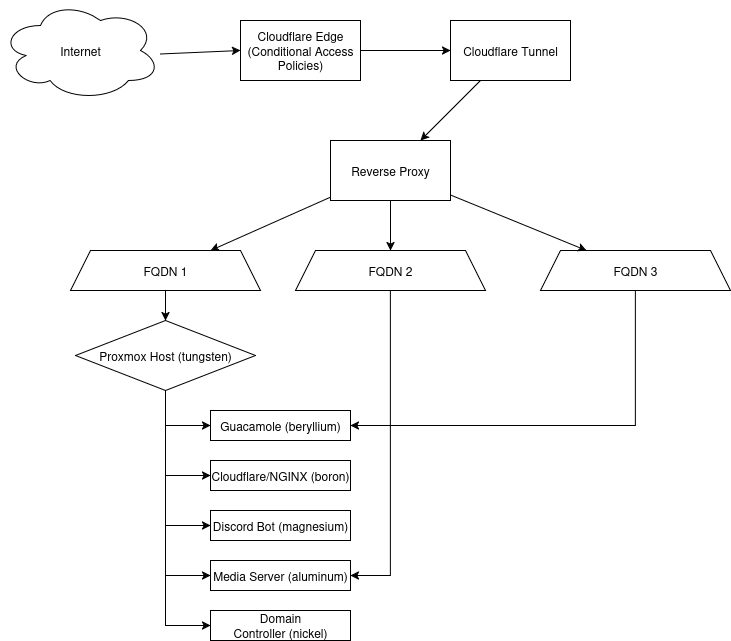

# homelab-docs
Documentation for my Proxmox-based home datacenter: AD, Plex, virtualization, remote access, and network security.


# ProtonSystems Datacenter

This repository documents the ProtonSystems homelab: a self-hosted IT environment designed for learning, development, and service hosting. The lab replicates core enterprise concepts including virtualization, Active Directory, secure remote access, and media services.

---

## 🔧 **Environment Summary**

- **Hypervisor:** `tungsten` — Proxmox VE host running core infrastructure
- **Active Directory Domain:** `three.local` managed by `nickel`
- **Media Services:** `aluminum` Plex Media Server with Radarr, and Sonarr
- **Reverse Proxy & Remote Access:**
  - `boron` — Cloudflare Tunnel, NGINX
  - `beryllium` — Apache Guacamole for browser-based remote desktop
- **Automation & Bots:** `magnesium` — Discord Bot with Plex integration
- **Networking:**
  - TP-Link Layer 2 managed switch
  - Dedicated Wi-Fi Access Point
  

---

## 🌐 **Network Topology**



---

## 📂 **Repository Structure**

```plaintext
homelab-documentation/
├── README.md              # Root overview: this file
├── network-topology.png   # Visual network diagram
├── LICENSE
├── tungsten/              # Proxmox host details
├── aluminum/              # Plex server VM
├── nickel/                # Domain Controller (AD/DNS)
├── boron/                 # Reverse proxy container
├── beryllium/             # Guacamole container
├── tungsten/              # Proxmox host 
└── magnesium/             # Bot repo reference

